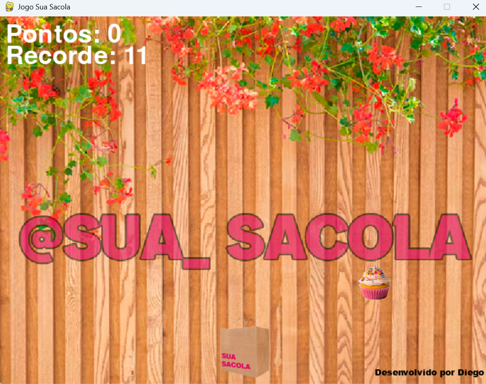

# 🛍️ Sua Sacola

Um jogo interativo desenvolvido em Python com a biblioteca **Pygame**.

<p align="center">
  
</p>

---

## 📝 Sobre o Jogo

**Sua Sacola** é um jogo em 2D desenvolvido em Python onde o jogador movimenta a sacola para capturar os itens que vão caindo na tela.

---

## 🛠️ Tecnologias Utilizadas

- **Python 3**
- **Pygame**

---

## 🚀 Como Executar o Jogo

### 1. Pré-requisitos

Certifique-se de ter o [Python](https://www.python.org/) instalado em seu computador.

### 2. Instalação do Pygame

Abra o terminal ou prompt de comando e instale a biblioteca do jogo:

```bash
pip install pygame
```
